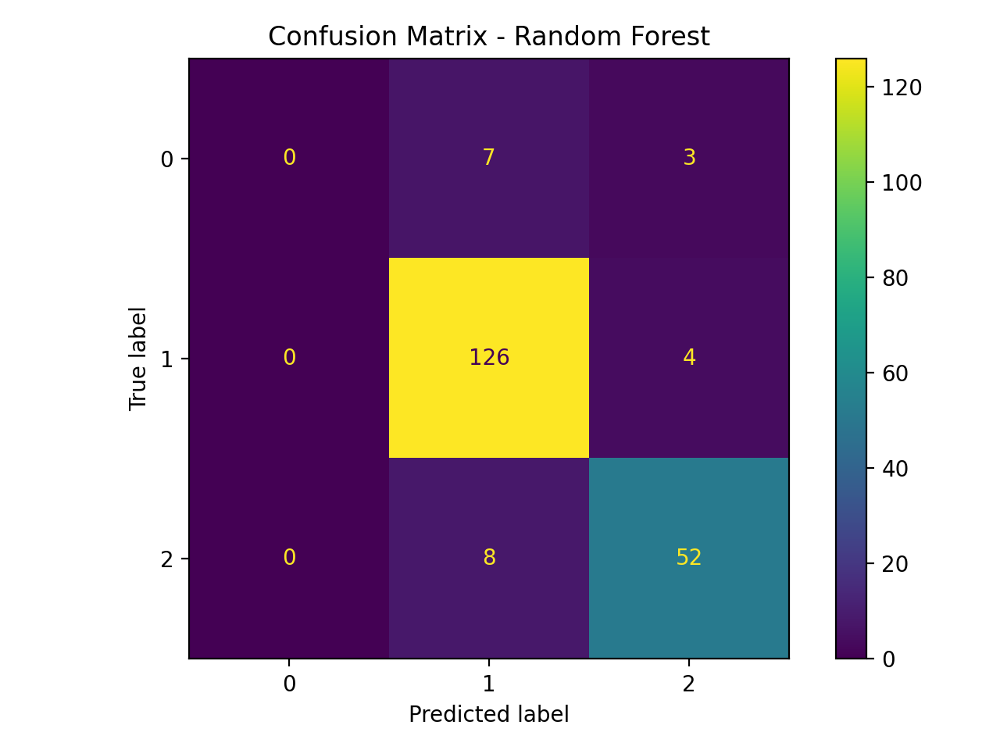
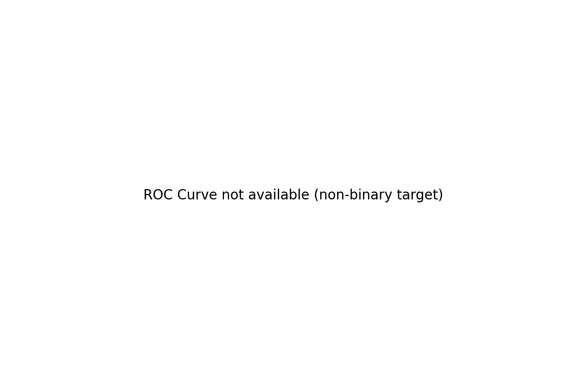

# CreditWise Loan Approval Prediction System 🏦📊

An end-to-end Machine Learning project that predicts whether a customer’s loan should be **Approved** or **Rejected** based on financial, credit, and demographic details.

This project is inspired by a real-world problem scenario where a bank faces delays and bias due to manual loan verification. The goal is to build a fast, accurate, and consistent ML-based approval assistant.

---

## 🚀 Problem Statement
A mid-sized financial company (SecureTrust Bank) receives hundreds of loan applications daily. The manual verification process is:
- Time-consuming
- Biased and inconsistent

This leads to:
1. Good customers rejected → business loss  
2. High-risk customers approved → financial loss  

So we build an **ML-powered intelligent loan approval system** to predict approval status before final human review.

---

## 📌 Dataset Overview
Each row represents one loan applicant with multiple features.

**Target column**
- `Loan_Approved` → `Yes` / `No`

**Key Features**
- Applicant income & co-applicant income
- Credit score, existing loans, DTI ratio
- Employment status, age, marital status, dependents
- Savings, collateral value, loan amount, loan term
- Property area, education level, gender, employer category

(Full column descriptions are available in `CreditWise Loan System.pdf`)

---

## 🔍 Project Workflow
1. **Data Cleaning**
2. **EDA (Exploratory Data Analysis)**
3. **Feature Engineering**
4. **Model Training**
   - Logistic Regression
   - KNN
   - Naive Bayes
   - Decision Tree
   - Random Forest
5. **Evaluation**
   - Accuracy, Precision, Recall, F1 Score
   - Confusion Matrix
   - ROC-AUC

---

## 🛠 Tech Stack
- Python
- Pandas, NumPy
- Matplotlib, Seaborn
- Scikit-learn

---

## 📂 Repository Structure
```
creditwise-loan-approval-system/
│── credit_wise.ipynb
│── loan_approval_data.csv
│── CreditWise Loan System.pdf
│── README.md
│── requirements.txt
│── app.py
│── .gitignore
│
├── assets/
│   ├── (add images here: confusion_matrix.png, roc_curve.png)
│
└── models/
    └── loan_model.pkl   (generated after training)
```

---

## ⚙️ How to Run Locally

### 1) Install dependencies
```bash
pip install -r requirements.txt
```

### 2) Run notebook
```bash
jupyter notebook
```

### 3) Run Streamlit demo (optional)
```bash
streamlit run app.py
```

---


---

## 📊 Visuals





## ✅ Future Improvements
- Hyperparameter tuning (GridSearchCV)
- Model explainability (SHAP)
- Deploy as web app (Streamlit/Flask)

---

## 👤 Author
**NAND PATEL**  
GitHub: https://github.com/Nandd11
